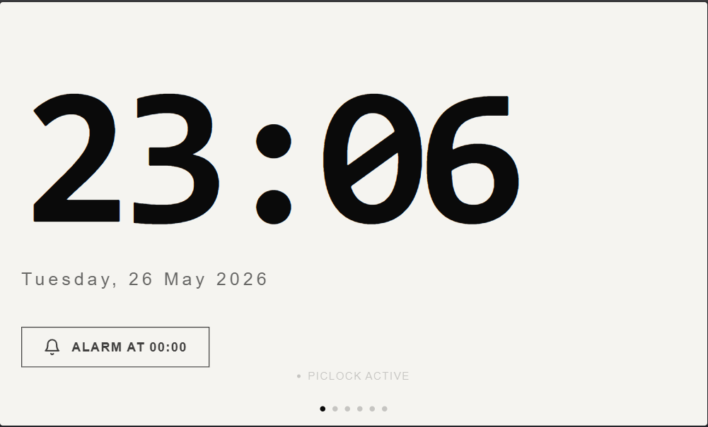
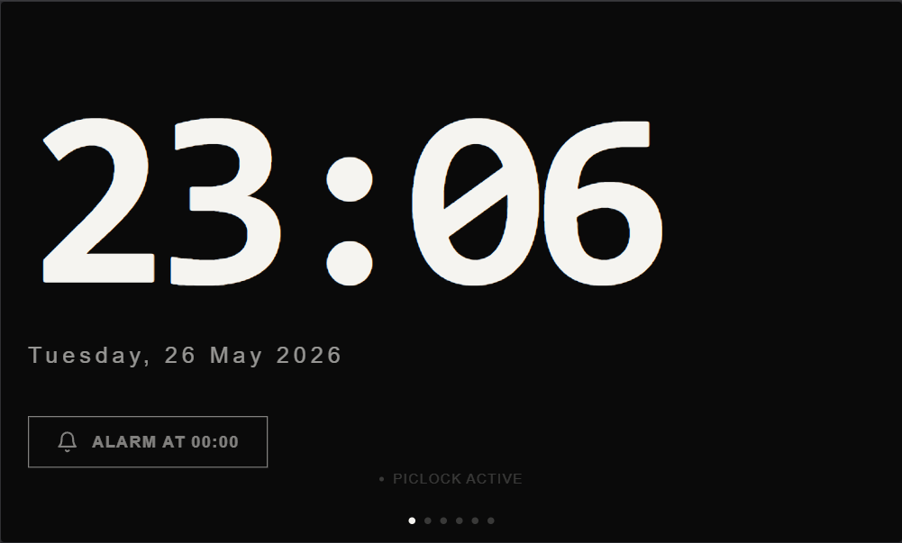
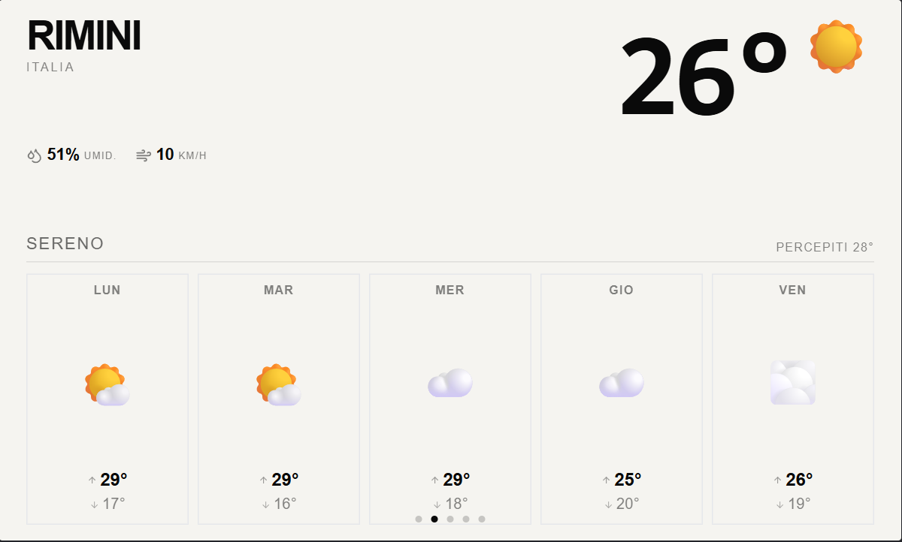
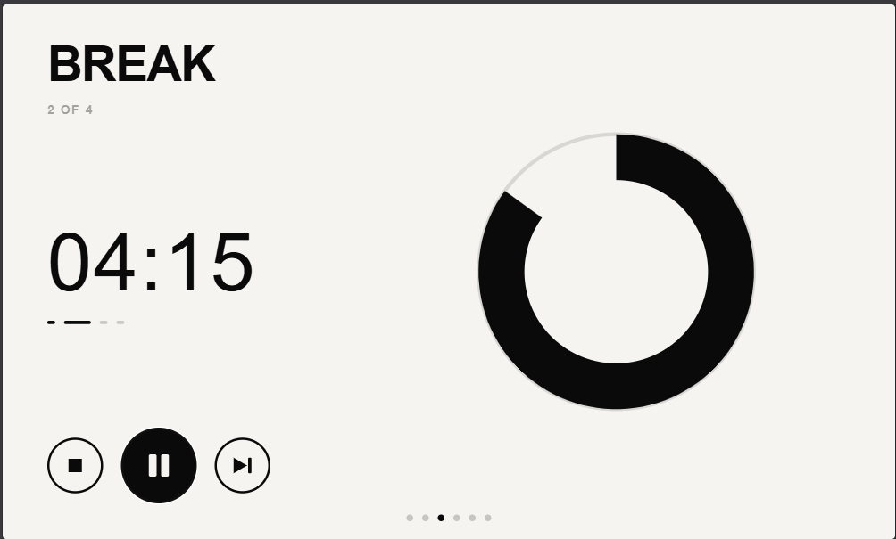
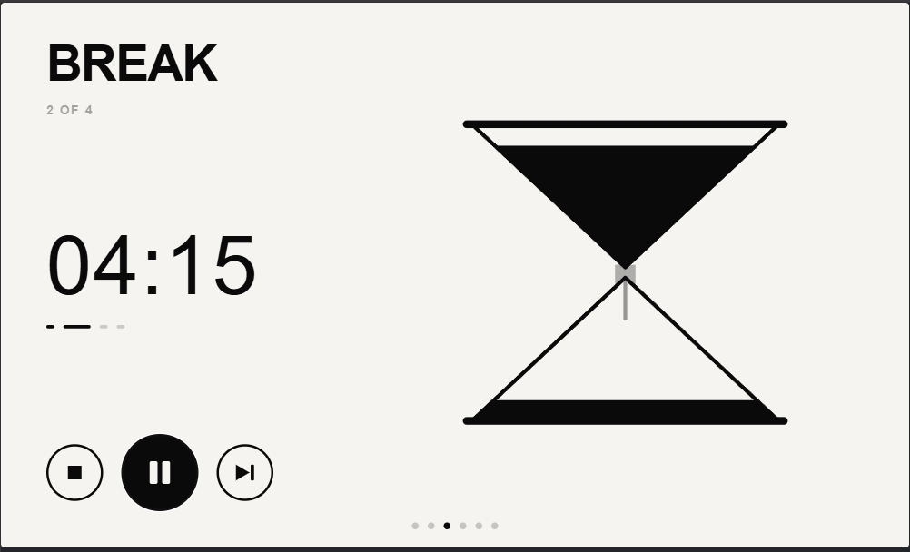
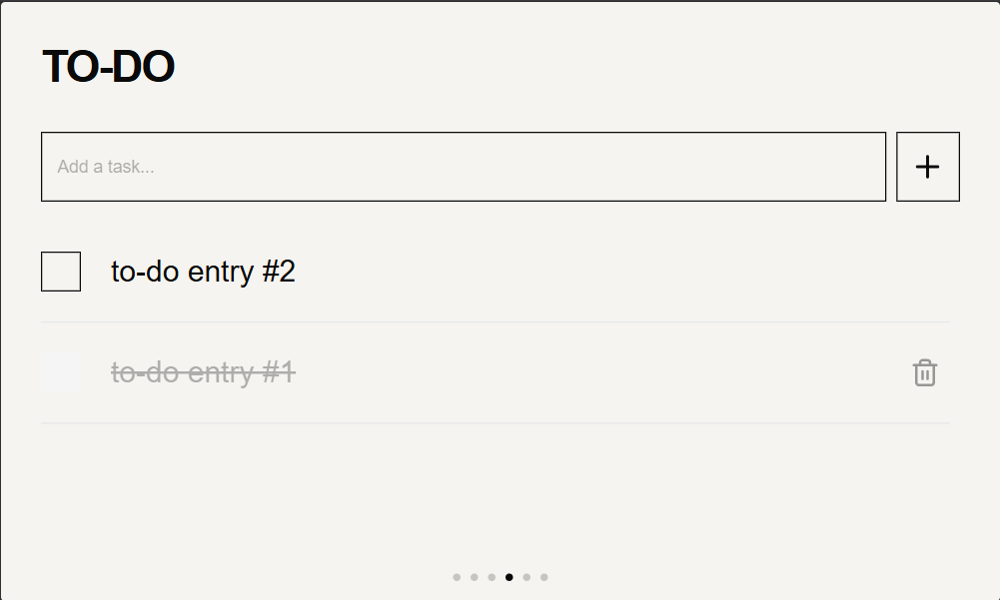
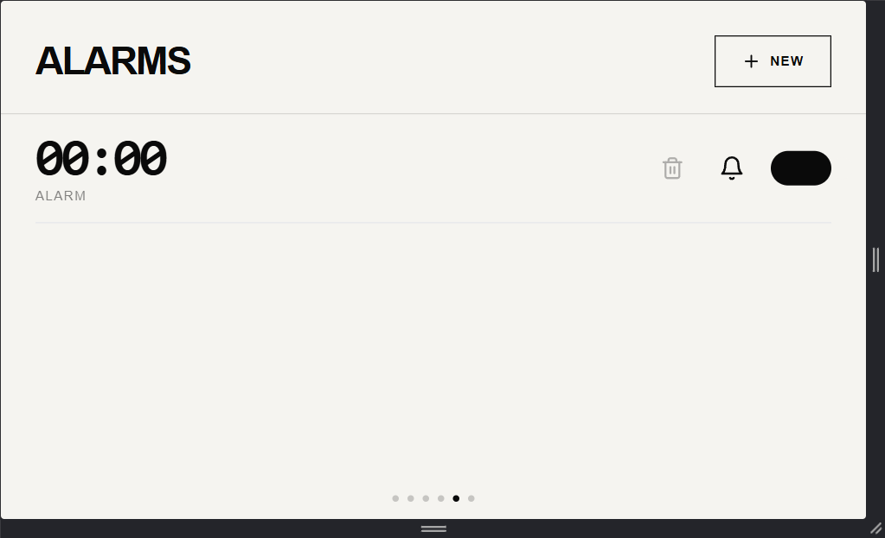
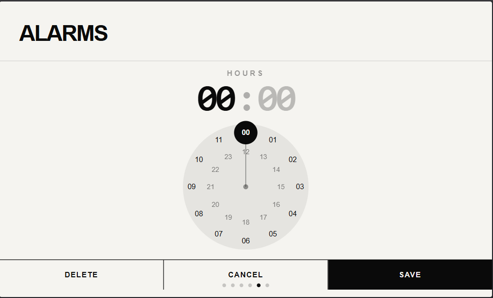
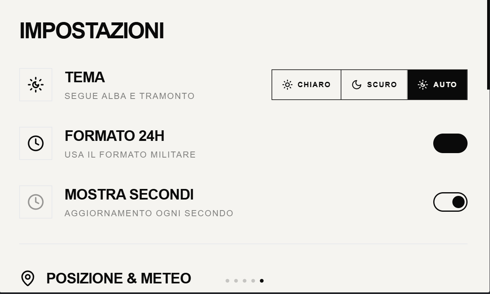

# PiClock (WIP)

A minimal, touch-friendly dashboard for **Raspberry Pi 3 Model B+** with a 4.3" 800×480 display - designed as a drop-in replacement for a Xiaomi Mi Smart Clock (x04g)

Swipe between pages to access the clock, weather, to-do list, and alarms. No cloud account, no subscription, no tracking.

    

---

## What it does

**Clock**  12h/24h format, optional seconds, configurable timezone. Clean, full-screen display optimized for e-paper-style readability at a glance. Shows next alarm time and system notifications (library scan progress, errors) as a live banner.

**Weather**  Powered by [Open-Meteo](https://open-meteo.com/) (free, no API key required). 5-day forecast with caching to minimize network calls.

**Pomodoro timer**  Multi-session focus timer with configurable cycle lengths. Supports short breaks between sessions and a long break at the end of each cycle. Visual progress shown as an animated hourglass SVG or a pie-chart arc (selectable from Settings). Controls: play/pause, skip to next phase, reset.

**To-do list**  Simple, persistent task list backed by SQLite. Add, check off, and delete tasks with touch-friendly controls.

**Alarms**  Scheduled with `node-schedule`, plays audio files in a loop from a local folder. Configurable snooze (1, 5, or 10 minutes). The alarm modal takes over the full screen when triggered, with Stop and Snooze buttons. Stopping an alarm automatically navigates to the Weather page.

**Song Highlights**  Uses `ffmpeg` (ebur128 loudness analysis) to detect the most intense moment of each audio file. Alarms start from that highlight instead of the beginning  so you wake up to the best part of the track. The library is scanned asynchronously at boot; progress is streamed live via SSE.

**Auto theme**  Light/dark mode that follows actual sunrise and sunset times, calculated with the NOAA solar formula from your configured coordinates.

**Internationalisation**  Full EN/IT interface, persisted in SQLite. Easily extensible to other languages by adding keys to `src/i18n/translations.ts`.

---

## Pages

The interface is a horizontal swipe carousel  four pages, all navigable by touch or mouse drag.

| Page | Content | Preview | 
|---|---|---|
| Clock | Time, date, next alarm indicator, system notifications |   | 
| Weather | Current conditions + 5-day forecast |  | 
| Focus | Focus timer with hourglass or arc visual, session pips, controls |   | 
| To-do | Task list with add/complete/delete |  | 
| Alarms | Alarm management |  | 
| Settings | Settings management |  |

---

## Tech stack

| Layer | Technologies |
|---|---|
| Frontend | React 19, TypeScript, Vite, Tailwind CSS, shadcn/ui, Zustand |
| Backend | Express 5, better-sqlite3 |
| Navigation | react-swipeable |
| Weather | Open-Meteo API |
| Audio playback | mpg123 / aplay (Linux/Pi) |
| Audio analysis | ffmpeg (ebur128 loudness) |
| Real-time events | SSE (Server-Sent Events) |

---

## Quick start

```bash
git clone https://github.com/patreekp/piclock.git
cd piclock
npm install
```

Then open two terminals:

```bash
# Terminal 1  backend
npm run server

# Terminal 2  frontend
npm run dev
```

Open `http://localhost:8080` in your browser.

For full setup, Raspberry Pi deployment, and configuration details, see **[INSTALLATION.md](wiki/Installation.md)**.

---

## License

MIT
